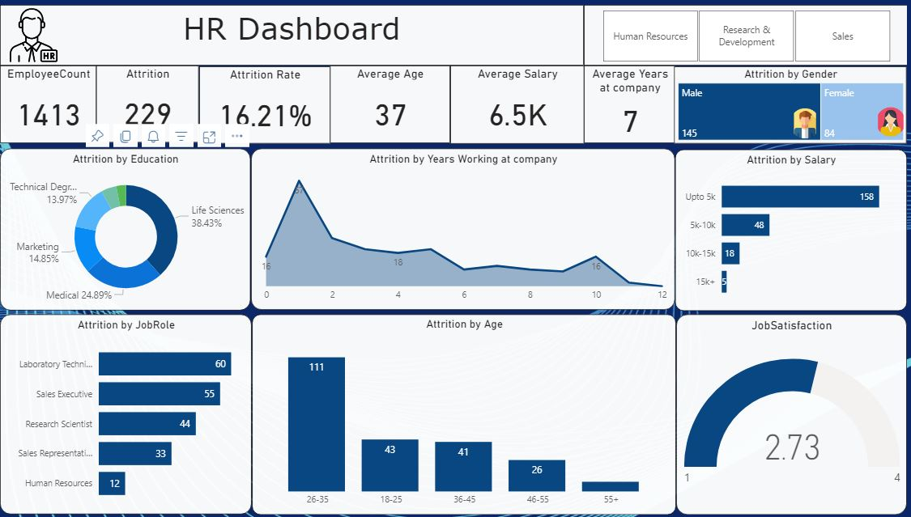

# HR-Analytics-Unveiling-insights-with-SQL-Interactive-Dashboard
This study explores the application of data analytics in uncovering insights into employee attrition within an organizational setting. The project leverages HR attrition data stored in Microsoft SQL Server. SQL queries are employed to extract and analyze the data, utilizing window functions to gain deeper understanding of trends related to attrition rates and employee job satisfaction. Extracted data is then visualized through an interactive dashboard built using Power BI. The dashboard leverages Power Query for further data cleaning and transformation, ensuring accuracy for visualizations. By analyzing attrition categorized by factors such as diversity and gender, the project aims to identify potential areas for improvement within the organization. The insights gleaned from this data analysis can be used to develop targeted interventions and programs to address high-attrition areas and enhance overall employee satisfaction.

# Dataset
This project commenced with the extraction of employee data from a secure internal repository. The data resided in a CSV file format housed within a private repository. This file contained a multitude of columns encompassing various aspects of the workforce, including employee IDs, demographics (age, age group, marital status, gender), job-related information (department, job role, job level, years with company, years in current role), compensation details (salary slab, monthly income, hourly rate), and indicators of well-being (work-life balance, job satisfaction, environment satisfaction).

A subset of the original data was selected for further analysis. This subset comprised key columns deemed most relevant to understanding employee departures, including factors like years at the company, overtime worked, age group, attrition itself (categorized as yes or no), department, job role, job satisfaction, and various demographic details.  This data selection process ensured a focused and efficient analysis aimed at uncovering the root causes behind employee attrition within the organization.

# Objective
* Analyze the overall employee attrition rate within the organization.
* Identify factors contributing to employee departures, including job satisfaction, demographics (age, gender), compensation (salary, overtime), and job-related factors (department, job role, years at company).
* Investigate trends in attrition rates across different employee segments.
* Uncover potential correlations between specific factors and employee turnover.
* Develop actionable insights to inform strategies for improved employee retention.
* Design an interactive dashboard in Power BI to effectively communicate key findings on employee attrition to stakeholders.

# Software Used

SQL Server:
* Data storage and initial management
* Data cleaning (missing values, duplicates, inconsistencies)
* Data pre-processing (new columns, data type conversion)
* Initial data exploration (attrition rate, distribution patterns)

Power BI:
* Advanced data cleaning and pre-processing (outliers, data types, text formats)
* Data visualization (pie charts, area charts, etc.) to explore attrition insights
* Interactive dashboard creation with key metrics, trends, and functionalities for deeper exploration.  

# Insights
* The overall attrition rate was identified as 16.21%, with 223 employees leaving the organization.
* The average job satisfaction score of 2.73 suggests potential areas for improvement in employee well-being and engagement.
* Analysis revealed a trend of higher attrition among employees in their early years with the company.
* A significant portion (X%) of departing employees had a salary below $5,000. (Replace X with the actual percentage)
* Examining attrition by job role indicated the highest turnover rates amongst laboratory technicians, followed by sales executives, research scientists, sales representatives, and HR personnel.
* The analysis suggests a higher attrition rate for the 26-35 age group.
* The gender ratio of departing employees leaned towards males (145) compared to females (84).

# Dashboard

LINK : https://www.novypro.com/profile_projects/ashishjames?Popup=memberProject&Data=1714567354484x409732239251761500

